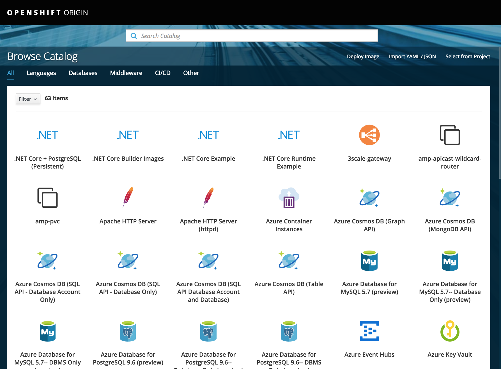
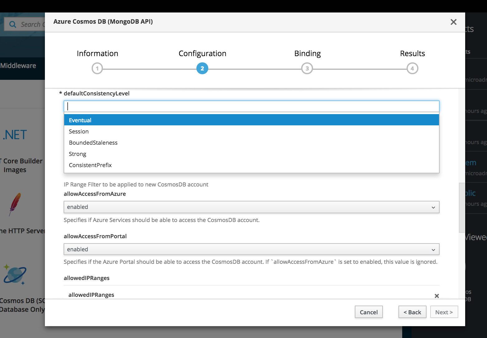
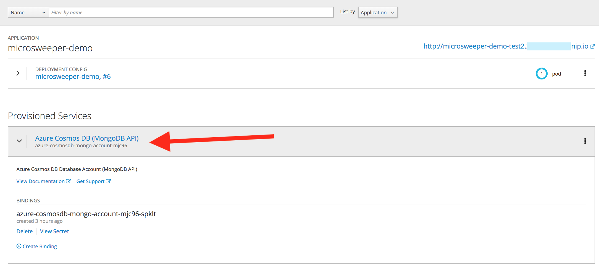
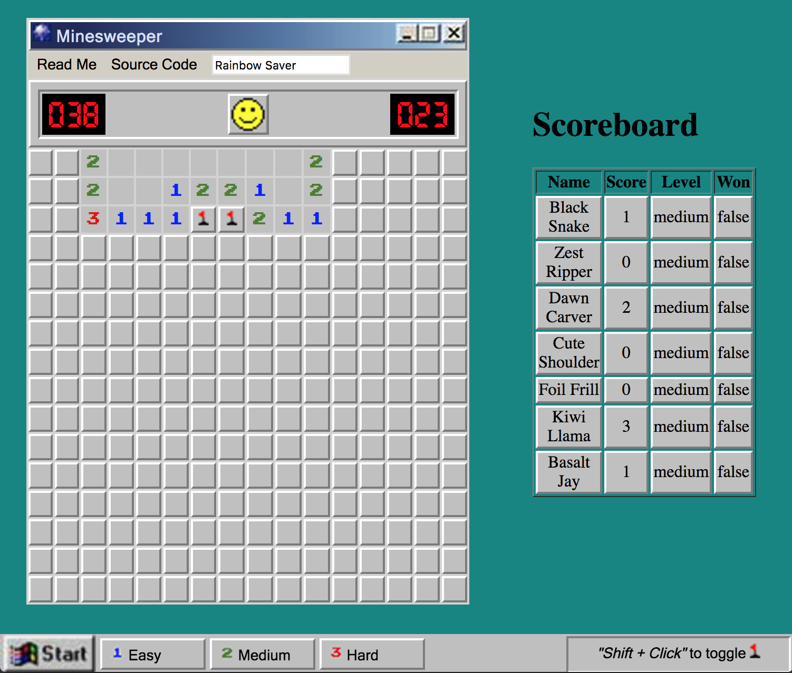
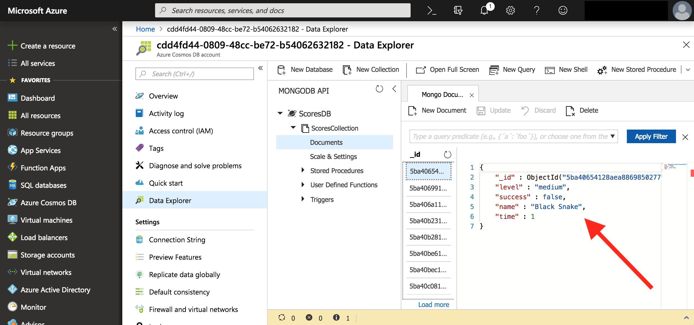

Red Hat Microsweeper demo
=========================

This demo uses a number of cloud technologies to implement a simple game from the earlier days of computing: Minesweeper!

Technologies include:

* JQuery-based Minesweeper written by [Nick Arocho](http://www.nickarocho.com/) and available on GitHub
* Backend baed on MicroProfile to persist scoreboard
* Deployed using Red Hat OpenShift and the Open Service Broker to deploy Cosmos DB on Microsoft Azure

To run demo
-----------
These steps are necessarily high level and encompass many smaller steps that will be added later.

* Get an [Azure Account](https://azure.microsoft.com/en-us/free/) (e.g. using an Azure Pass)
* Use an OpenShift OKD [all-in-one installer](https://portal.azure.com/#create/Microsoft.Template/uri/https%3A%2F%2Fraw.githubusercontent.com%2Fcealsair%2FMicroProfileOnAzure%2Fmaster%2Fallinone.json) to deploy to Azure. Takes about 20 minutes.
* Install the [Open Service Broker for Azure](https://github.com/Azure/open-service-broker-azure) version 0.11.0 (use the helm charts `--version 0.11.0` option) to your OpenShift instance
 * Note the latest Open Service Broker has temporarily removed Cosmos DB as it's considered experimental
* Provision an instance of [CosmosDB](https://docs.microsoft.com/en-us/azure/cosmos-db/introduction) to a new OpenShift project using the Service Broker, and elect to create a _binding_ to a new project
* Deploy this sample app to that project via:
 * `mvn clean package fabric8:deploy`
* Edit the `microsweeper` Deployment Config and add new environment variables based on the newly-created secret from the service instance.
 * Be sure to use a `SCORESDB_` prefix when adding the env vars

Then run `mvn clean package fabric8:deploy` to deploy.

Once deployed access the UI using the route exposed via OpenShift. And re-live your youth like a boss.

Eye Candy
=========

_Service Catalog in OpenShift_

-----

_Deploying Azure service through OpenShift Service Catalog_

-----

_OpenShift Project with deployed service_

-----

_Money Shot_

-----

_Browsing Minesweeper scoreboard from Azure Portal_

